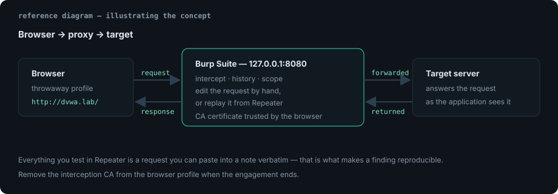

A proxy in the middle of the browser and the server is the single most useful
tool in web testing. This note is the setup that has to work before any of the
interesting parts do, plus the workflow that keeps findings reproducible.

## Lab setup

```text
Proxy listener : 127.0.0.1:8080
Browser        : a separate profile, proxy set to 127.0.0.1:8080
Scope          : http://dvwa.lab and http://juice.lab only
Certificate    : Burp CA installed in the browser profile's trust store
```

Keeping a dedicated browser profile matters. You want a trust store containing
exactly one extra CA, and a proxy setting that does not affect your normal
browsing.



## Trusting the CA certificate

Intercepting HTTPS means Burp re-signs each connection with its own CA. The
browser must trust that CA or every request fails with a certificate error.

1. With the proxy active, browse to `http://burp` (or use the *Proxy → Options →
   Import / export CA certificate* button) and download the DER certificate.
2. Import it into the browser profile's certificate store as a trusted root.
3. On a Linux lab VM, install it system-wide so CLI tools work too:

```bash
sudo cp cacert.der /usr/local/share/ca-certificates/burp-ca.crt
sudo update-ca-certificates
```

```bash
# Python and friends need pointing at the bundle too.
export REQUESTS_CA_BUNDLE=/etc/ssl/certs/ca-certificates.crt
curl -x http://127.0.0.1:8080 -k https://dvwa.lab/
```

> [!WARNING]
> A trusted interception CA lets anything holding the matching private key read
> your TLS traffic. Use a throwaway browser profile, and remove the certificate
> when the engagement ends — an interception CA left installed on a work laptop
> is a finding in itself.

## The four tabs, and what each is for

| Tool | Use it when |
| --- | --- |
| Proxy → HTTP history | you want to see what the application actually sent |
| Repeater | you want to change one field and resend it a hundred times |
| Intruder | you want the same request with a wordlist in one position |
| Decoder / Comparer | you need to decode a token or diff two responses |

The habit worth building: **never test in the browser if Repeater can do it.**
A request replayed from Repeater is a request you can copy into a note verbatim.

## From interception to a reproducible test

```text
1. Find the request in Proxy → HTTP history (filter to in-scope only).
2. Ctrl+R to send it to Repeater.
3. Change exactly one thing: one parameter, one header, one byte.
4. Send, and read the status line, the length, and the body.
5. Save the raw request/response pair into your notes when it matters.
```

That fifth step is what turns "the app seemed weird here" into evidence. A
request you cannot reproduce is not a finding.

## Reading a raw request

```http
POST /vulnerabilities/sqli/ HTTP/1.1
Host: dvwa.lab
Content-Type: application/x-www-form-urlencoded
Cookie: PHPSESSID=REDACTED; security=low
Content-Length: 46
Connection: close

id=1&Submit=Submit
```

Four things to check on every request before you touch the payload:

- the `Cookie` header — is a session token or a `role=` style flag actually
  signed, or is it just trusted?
- any parameter used for authorization (`admin=0`, `user_id=2`)
- `Content-Type` — form-encoded, JSON and multipart are parsed differently, and
  swapping the content type is a cheap bypass test
- the exact path — trailing slashes and `..;/` segments reach different handlers

## Match and replace rules worth having on

| Rule | Why |
| --- | --- |
| Set `X-Forwarded-For: 127.0.0.1` | tests IP-allowlist logic that trusts a header |
| Set `User-Agent: <phone UA>` | reveals mobile-only endpoints with weaker checks |
| Remove `If-None-Match` / `If-Modified-Since` | stops cached responses confusing a retest |
| Add `X-Forwarded-Proto: https` | exercises redirect and secure-cookie branches |

Keep these in a saved project options file so a lab does not silently inherit a
production profile's rules, or vice versa.

## Practical notes

- Set target scope early (*Target → Scope*) and turn on *Proxy → Options →
  Intercept is out of scope*. History stays readable and you stop fighting your
  own browser's telemetry requests.
- `Ctrl+Shift+R` in Repeater keeps the raw bytes; normal paste can normalise
  whitespace that mattered to a signature check.
- Use *Comparer* on two responses rather than eyeballing them — a 3-character
  difference in a JSON body is easy to miss and often is the whole bug.
- Burp's built-in browser has its own CA trust, which removes a whole class of
  setup problems; use it when you do not need your own extensions.
- Export Repeater items you care about (*Save item*) into the target's `scans/`
  folder. Notes plus raw requests is what makes a report reviewable.

## References

- [PortSwigger — Getting started with Burp Suite](https://portswigger.net/burp/documentation/desktop/getting-started)
- [PortSwigger Web Security Academy](https://portswigger.net/web-security)
- [OWASP WSTG — Testing for Weak Transport Layer Security](https://owasp.org/www-project-web-security-testing-guide/)
