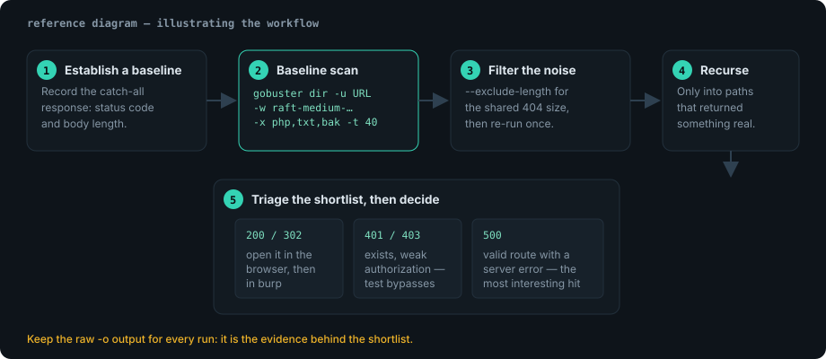

A web server shows you the front door and nothing else. Content discovery is
about walking the rest of the building: backups, admin panels, forgotten API
paths, source maps, `.git` directories.



## Baseline scan

```bash
gobuster dir \
  -u http://10.10.10.31 \
  -w /usr/share/seclists/Discovery/Web-Content/raft-medium-directories.txt \
  -t 40 \
  -x php,txt,bak,old,zip \
  -o scans/gobuster-root.txt \
  --timeout 10s
```

Flags worth understanding rather than copying:

| Flag | Why it matters |
| --- | --- |
| `-w` | the wordlist; start with `raft-medium-*` and escalate only if needed |
| `-x` | appends extensions so `admin` also tries `admin.php`, `admin.bak` … |
| `-t` | concurrency. 40 is gentle; 200 against a VM you own is fine, against anything else it is not |
| `-o` | always keep raw output; you will want to re-read it tomorrow |
| `-k` | skip TLS verification for self-signed lab certificates |
| `--exclude-length` | drop a byte-length that every response shares (custom 404 pages) |

## Handling the custom-404 problem

Modern frameworks return `200 OK` with a friendly "not found" page for every
path. Every request looks identical, so every request looks interesting.

```console
$ curl -s -o /dev/null -w '%{http_code} %{size_download}\n' http://10.10.10.31/thisdoesnotexist
200 1284
```

Note the size: `1284` bytes is the catch-all page. Filter it out:

```bash
gobuster dir -u http://10.10.10.31 -w raft-medium-directories.txt \
  --exclude-length 1284 --exclude-length 0 \
  -t 40 -o scans/gobuster-filtered.txt
```

> [!TIP]
> Run a scan once *without* filters to see the noise distribution, then add
> `--exclude-length` for the size that dominates. Two scans now beat an hour of
> manually eyeballing 4,000 lines of `200`.

## Recursive discovery, done deliberately

Gobuster does not recurse. That is a feature: you decide what is worth a second
pass, so you do not spend 40 minutes enumerating a generic `/images/` tree.

```bash
# Second pass only on paths that returned something real.
for path in /admin /api /backup /dev; do
  gobuster dir -u "http://10.10.10.31${path}/" \
    -w /usr/share/seclists/Discovery/Web-Content/raft-small-words.txt \
    -x php,json,bak -t 25 -o "scans/gobuster$(echo "$path" | tr '/' '-').txt"
done
```

## What is worth escalating

- `200` with a non-trivial body → open it in the browser, then in #burp-suite.
- `301`/`302` → note the redirect target; directory listings hide there.
- `401`/`403` → an existing resource with weak authorization. Test the bypass
  cases (trailing slash, `..;/`, case variation, `X-Original-URL`).
- `500` → an application error on a valid route. Usually the most interesting
  result in the whole scan.
- `.git/HEAD`, `.env`, `backup.zip`, `*.sql`, `*.old` → secrets and source.

```bash
# Quick triage of a shortlist, one line per path.
grep -E 'Status: (200|301|302|401|403|500)' scans/gobuster-filtered.txt \
  | sort -t' ' -k2 > scans/shortlist.txt
```

## DNS and vhost mode

When the same IP serves several sites, directory brute force is the wrong tool:

```bash
# Subdomain discovery from the response codes themselves.
gobuster dns -d example.lab -w /usr/share/seclists/Discovery/DNS/subdomains-top1million-5000.txt \
  --show-ips -o scans/dns.txt

# Virtual-host discovery against the same IP.
gobuster vhost -u http://10.10.10.31 -w subdomains-top1million-5000.txt \
  --append-domain --exclude-length 1284 -o scans/vhosts.txt
```

> [!NOTE]
> `vhost` mode finds hosts that exist *only* in the server configuration. A hit
> here frequently means a staging copy with weaker controls than production, so
> it is worth a second look before you dismiss the result.

## Operational hygiene

1. Keep a `scans/` directory per target and never overwrite yesterday's run.
2. Rate-limit anything outside your own lab. A brute-force run is a load test
   whether or not you intended one.
3. Record the wordlist path *and* its commit or package version — "we found
   `/admin`" is not reproducible without it.
4. Re-run after authentication is obtained: logged-in wordlists file the
   difference between a public surface and an authenticated one.

## References

- [Gobuster documentation](https://github.com/OJ/gobuster)
- [SecLists](https://github.com/danielmiessler/SecLists)
- [OWASP WSTG — Review Web Server Content](https://owasp.org/www-project-web-security-testing-guide/)
