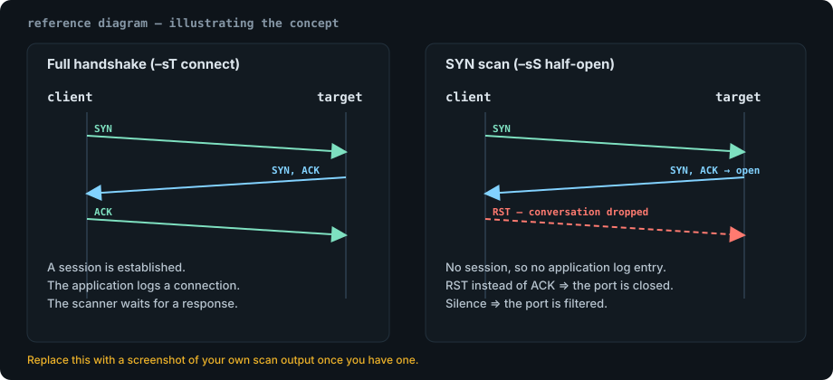

Port scanning is the first thing most engagements start with, and `-sS` is the
flag everybody types without thinking about why. This note is the "why": the
packets on the wire, the four responses you will see, and the operational
reasons a SYN scan beats a full TCP connect.

## The idea in one paragraph

A TCP connection starts with a three-way handshake. A SYN scan never finishes
that handshake — it sends the initial `SYN`, reads the reply, and tears the
conversation down. No session is ever established, so the target application
never logs a completed connection.



## What each response means

| Response from target | Port state | What it tells you |
| --- | --- | --- |
| `SYN, ACK` | open | Something is listening and willing to talk |
| `RST` | closed | the TCP/IP stack answered, nothing is listening |
| no reply at all | filtered | a firewall or host firewall dropped the packet silently |
| `ICMP unreachable (type 3, code 3)` | filtered | a router rejected the packet explicitly |
| `ICMP unreachable (type 3, code 1/2/9/10/13)` | filtered | protocol, port or admin-prohibited rejection |

The distinction that matters for reporting is **closed vs filtered**. "Closed"
means the host is reachable and the port is genuinely shut. "Filtered" means you
learned nothing about the port — only that something in the path is dropping
traffic.

> [!TIP]
> In a report, "filtered" is not a vulnerability. It is an unknown. Log it as
> such so the reader does not confuse "we could not prove it is open" with
> "we proved it is closed".

## The command I actually use

```bash
# Fast default sweep: top 1000 TCP ports, no ping, no name resolution.
sudo nmap -sS -Pn -n --top-ports 1000 -T4 -oA scans/tcp-top1000 10.10.10.24

# Full TCP range once the host is confirmed alive.
sudo nmap -sS -Pn -n -p- --min-rate 2000 -oA scans/tcp-allports 10.10.10.24

# Then targeted service/version and default scripts on what is open.
sudo nmap -sV -sC -p 22,80,445,8080 -oA scans/services 10.10.10.24
```

Splitting the work like this matters: `-p-` produces 65,535 probes, so run it
once, store it with `-oA`, and never re-scan a host just to remember what was
open.

## Why `-sS` and not a connect scan

<details>
<summary>Details: what `-sS` needs and how it differs from `-sT`</summary>

<div>

A SYN scan builds raw packets and therefore needs `CAP_NET_RAW` (on most
distributions that means running it with `sudo`, or granting the `nmap`
binary the capability once and for all).

| | `-sS` half-open | `-sT` connect |
| --- | --- | --- |
| needs root / raw sockets | yes | no |
| completes the handshake | no | yes |
| speed on a fast network | higher | lower |
| visible to application logs | no | often yes |
| works through a SOCKS proxy | no | yes |

If you are on a box where you cannot get raw sockets, `-sT` is not a mistake —
it is the correct tool for that constraint, just noisier.

</div>
</details>

## Reading the output without lying to yourself

```console
$ sudo nmap -sS -Pn -n --top-ports 20 10.10.10.24
Starting Nmap 7.94 ( https://nmap.org ) at 2026-10-05 09:14 UTC
Nmap scan report for 10.10.10.24
Host is up (0.019s latency).
PORT     STATE    SERVICE
22/tcp   open     ssh
80/tcp   open     http
111/tcp  filtered rpcbind
139/tcp  closed   netbios-ssn
445/tcp  open     microsoft-ds

Nmap done: 1 IP address (1 host up) scanned in 1.71 seconds
```

Three things worth noticing:

1. `139/tcp closed` — the host answered with `RST`, so the machine is definitely
   up. That is a stronger liveness signal than the ping in many lab networks.
2. `111/tcp filtered` — usually an upstream ACL rather than a host setting.
3. `Host is up (0.019s latency)` with `-Pn` means Nmap inferred up-ness from the
   scan responses themselves, because we told it not to ping.

> [!WARNING]
> `-T4` and `--min-rate 2000` are fine against a lab VM you own. Against
> production appliances or anything behind an IPS they will get your source
> address null-routed, and in a real engagement that can be a reportable denial
> of service. Match the aggression to the signed scope, not to your patience.

## Practical notes that save time

- `-Pn` is worth having on by default in lab networks: hosts frequently drop ICMP
  while happily answering on TCP.
- `--reason` prints *why* Nmap believes a state. When you are confused about
  `filtered` versus `closed`, it is the fastest way to find out.
- `-oA <base>` writes normal, XML and grepable output with one flag. The XML is
  what you parse later; the normal output is what you paste into notes.
- Timestamps in `-oA` files are the difference between "this looked open last
  Tuesday" and an unsupported claim.
- Scan the same host with `-sU` only when you have a reason (SNMP, DNS, NetBIOS).
  UDP scanning is slow and its "open|filtered" verdict is genuinely ambiguous.

A quick way to check service versions without guessing:

```bash
sudo nmap -sV --version-intensity 5 -p 80,8080 10.10.10.24 | tee scans/web-versions.txt
```

## Related tooling

Once ports are known, the follow-up work usually belongs in another note: web
content discovery with #gobuster, a proxy for application testing with
#burp-suite, and the Linux-side privilege escalation questions that open up as
soon as you get a shell (#linux, #privilege-escalation).

## References

- [Nmap reference guide — port scanning techniques](https://nmap.org/book/man-port-scanning-techniques.html)
- [Nmap reference guide — timing and performance](https://nmap.org/book/man-performance.html)
- [RFC 793 — Transmission Control Protocol](https://www.rfc-editor.org/rfc/rfc793)
