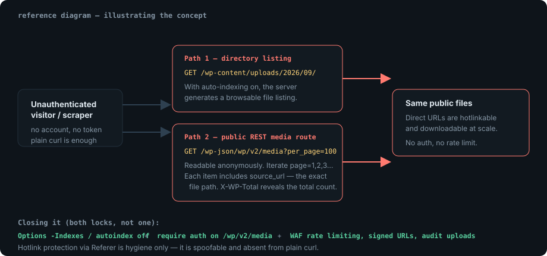

If your site serves files straight out of `wp-content/uploads/`, those files are
public by URL — that is how hotlinking works in the first place. The interesting
question is how much *more* than the single URL leaks:

```text
https://mywebsite.com/wp-content/uploads/2026/09/file.mp4
```

With directory listing enabled, everything in that folder is browsable. With the
public REST media route open, the site will hand out an index of its media
library — direct file URLs, 100 items at a time.

> [!LAB]
> Everything below is meant for **a WordPress installation you own or are
> contractually authorized to test**. Enumerating a stranger's uploads is not
> research.

## The two exposures

### 1. Directory listing on the uploads tree

Uploads live in predictable, date-based folders (`2026/09/`), which makes them
cheap to walk. If the web server has auto-indexing on, requesting the folder
returns a generated file listing instead of a 403.

```console
$ curl -s -o /dev/null -w 'listing: %{http_code}\n' \
    "https://mywebsite.com/wp-content/uploads/2026/09/"
listing: 200

$ curl -s "https://mywebsite.com/wp-content/uploads/2026/09/" | grep -oE 'href="[^"]+"' | head -5
href="file.mp4"
href="invoice-2026-09.pdf"
href="backup.zip"
```

A `200` on a directory path is the tell. A well-configured host answers `403`
and the enumeration stops there.

### 2. The public REST API media route

WordPress ships a REST API. The `media` collection is readable without
authentication on most installs, and each item includes a `source_url` — the
direct path to the file:

```bash
curl -s "https://www.mywebsite.com/wp-json/wp/v2/media?per_page=100&page=1" \
  | jq -r '.[].source_url'
```

Pagination is the whole trick: `page=2`, `page=3`, and so on. You rarely have to
guess how many pages exist, because WordPress helpfully reports it in headers:

```console
$ curl -sI "https://www.mywebsite.com/wp-json/wp/v2/media?per_page=1" | grep -i x-wp-total
X-WP-Total: 1284
X-WP-TotalPages: 13
```

`X-WP-Total` / `X-WP-TotalPages` turn "is this worth walking?" into a one-request
question. From the returned URLs the files can then be hotlinked or downloaded
directly — no authentication, no rate limit, nothing to notice.

> [!NOTE]
> This is not a WordPress core vulnerability. It is an exposure and
> misconfiguration issue: public media by design, plus an API that indexes it,
> plus no edge control in front of either.



## Why it matters more than "someone stole my images"

Bandwidth theft is the least of it. The uploads directory is a dumping ground,
and it usually contains far more than images:

| What tends to be in `uploads/` | What an enumerator gains |
| --- | --- |
| Invoices, receipts, signed contracts (PDF) | counterparties, pricing, client names |
| Exported CSVs and spreadsheet templates | customer or order data |
| `.zip` backups and plugin debug dumps | source code, config, sometimes credentials |
| Images with EXIF intact | GPS coordinates, device and author metadata |
| "Unlisted" marketing assets | launch plans, product names, embargoed material |
| Consistent filename patterns | a list of clients or staff to target |

Combined with the two exposures above, that stops being a leak of pictures and
becomes a structured map of the organisation.

## Reducing exposure

### Disable directory listing at the web-server level

Apache — in `.htaccess` or the vhost:

```apache
# Never generate a listing for the uploads tree.
Options -Indexes
```

nginx:

```nginx
location /wp-content/uploads/ {
    autoindex off;
}
```

This closes the listing but **not** the door: known URLs still resolve, and the
REST route is untouched. It is one of two locks, not the lock.

### Restrict anonymous access to the media route

Blocking the route surgically is better than disabling the REST API wholesale —
killing all of `/wp-json/` breaks the block editor, plugins and any headless
front end. This filter returns `401` only for anonymous requests to the media
collection:

```php
/**
 * Require authentication for the media REST collection.
 * Put this in a small site-specific plugin, not in a theme's functions.php.
 */
add_filter( 'rest_authentication_errors', function ( $result ) {
    if ( ! empty( $result ) ) {
        return $result; // an earlier check already rejected the request
    }
    if ( is_user_logged_in() ) {
        return $result;
    }
    $route = isset( $GLOBALS['wp']->query_vars['rest_route'] )
        ? $GLOBALS['wp']->query_vars['rest_route']
        : '';
    if ( 0 === strpos( $route, '/wp/v2/media' ) ) {
        return new WP_Error( 'rest_forbidden', 'Authentication required.', array( 'status' => 401 ) );
    }
    return $result;
} );
```

If you would rather not run PHP, do it at the edge — a WAF rule or reverse-proxy
rule that challenges or blocks anonymous `GET /wp-json/wp/v2/media`:

```nginx
# Reverse proxy / CDN origin rule: the media API is for logged-in editors only.
location ^~ /wp-json/wp/v2/media {
    # Allow the admin API calls that carry an auth cookie or application password,
    # deny everything else. Test this before trusting it: many REST clients send
    # no Authorization header even when authenticated by cookie.
    if ($http_cookie !~* "wordpress_logged_in") {
        return 401;
    }
    try_files $uri $uri/ /index.php?$args;
}
```

> [!WARNING]
> Test any edge rule against the editor, a backup plugin and your caching layer
> before deploying. A rule that blocks authenticated media requests will break
> the media library UI and image uploads, and you will find out at the worst
> possible moment.

### Hotlink protection — useful, but not a boundary

`Referer` rules stop casual embedding and leeching:

```apache
RewriteEngine On
# Allow empty referer (direct visits) and our own domain; refuse every other site.
RewriteCond %{HTTP_REFERER} !^$
RewriteCond %{HTTP_REFERER} !^https://(www\.)?mywebsite\.com/ [NC]
RewriteRule ^wp-content/uploads/.*\.(jpe?g|png|gif|webp|avif|mp4|webm)$ - [F,NC]
```

Treat this as traffic hygiene only. `Referer` is trivially spoofed, and a plain
`curl` — as used throughout this note — sends none at all, which most hotlink
rules are configured to permit. It does not stop enumeration or downloading.

### Controls that actually hold

- **Rate limiting at the CDN or WAF**, keyed on IP and path prefix. Enumeration
  is high-volume and repetitive; throttling makes it expensive even when it works.
- **Signed URLs for private media** (short-lived tokens, S3 presigned links) so a
  leaked path expires.
- **Keep sensitive files out of the public upload tree entirely.** Anything that
  is not a website asset belongs in protected storage or behind authentication,
  not in `wp-content/uploads/`.
- **Strip metadata on upload** so published images do not carry GPS and author
  data.
- **Audit what is already there** and delete what should never have been public.
  Rotation matters more than prevention here — old invoices stay exposed forever
  otherwise.
- **Block indexing of uploads** in `robots.txt` and remove already-indexed files
  from search engines. Search-engine image and PDF indexing is a third
  enumeration path you do not control.

> [!TIP]
> Do not rely on unguessable filenames. The folder structure is predictable,
> uploads are indexed by search engines, and the REST route hands over exact
> URLs. Obscurity is a delay, not a control.

## Detecting the scraping

Enumeration is noisy in exactly two ways, and both are visible in an access log:

```bash
# 1. Anonymous walking of the media API: repeated page= requests.
grep -oE '"GET /wp-json/wp/v2/media[^"]*"' access.log \
  | sed 's/[0-9]\{4,\}/<date>/' | sort | uniq -c | sort -rn | head -20

# 2. Directory-ending requests to uploads — the signature of listing probes.
#    ($7 is the request path, $9 the status, in combined log format.)
awk '$7 ~ /^\/wp-content\/uploads\/.*\/$/ && $9 == 200 { print $1 }' access.log \
  | sort | uniq -c | sort -rn | head
```

What to look for, in priority order:

| Signal | Why it stands out |
| --- | --- |
| `page=` iteration on `/wp/v2/media` | No human browses an API endpoint by page number |
| High `200` share on `/wp-content/uploads/…/` with trailing slash | Normal visitors request files, not folders |
| One IP with hundreds of uploads requests in minutes | Download or mirror behaviour |
| `Referer` that is empty or foreign on every file request | Hotlinking, or a script with no referer |
| Sequential or pattern-matched filenames requested in order | Scripted discovery, not browsing |
| Requests at a fixed human-sleep-hour cadence from cloud IP ranges | Automated scraping fleet |

Alerts worth having: any `200` on an uploads **directory** path, and more than
`N` distinct `/wp-json/wp/v2/media` requests from a single IP per hour.

## Checklist for a site review

1. Does `GET /wp-content/uploads/<year>/<month>/` return `200` or `403`?
2. Does `GET /wp-json/wp/v2/media?per_page=1` return `200` anonymously, and does it
   report `X-WP-Total`?
3. Is anything in `uploads/` that a stranger should not have — PDFs, archives,
   exports, backups?
4. Are the same files discoverable through a search engine?
5. Is there any rate limiting or bot mitigation in front of the file paths?
6. After fixing: re-test 1 and 2 from an unauthenticated session, then confirm the
   media library still works for a logged-in editor.

## Related notes

Content discovery tooling against a web root is covered in
[Directory Enumeration with Gobuster](/notes/gobuster-directory-enumeration/);
for interrogating the REST responses by hand,
[Intercepting Requests with Burp Suite](/notes/burp-intercepting-requests/) is the
practical companion.

## References

- [WordPress REST API handbook — Media](https://developer.wordpress.org/rest-api/reference/media/)
- [WordPress Advanced Administration — Hardening](https://developer.wordpress.org/advanced-administration/security/hardening/)
- [Apache core — `Options` directive](https://httpd.apache.org/docs/2.4/mod/core.html#options)
- [nginx `ngx_http_autoindex_module`](https://nginx.org/en/docs/http/ngx_http_autoindex_module.html)
- [OWASP WSTG — Review Web Server Configuration](https://owasp.org/www-project-web-security-testing-guide/)
